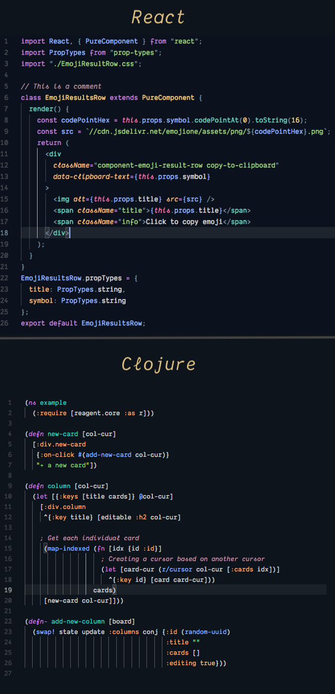

# After Dark

## _Theme for your eyes_ ✨

##### _Vivid colors, Medium Contrast, Clear comments._

Optimized for:

- Javascript & React & Vue
- Html & Css
- Clojure & ClojureScript (_Currently working on this_)

## Installation

1.  Install [Visual Studio Code](https://code.visualstudio.com/)
2.  Go to **After Dark** page at [Marketplace](https://marketplace.visualstudio.com/items?itemName=ssmi.after-dark)
3.  Click **Install** to install it
4.  In VSCode, click **Reload** to reload the Code
5.  From the menu bar click: Code > Preferences > Color Theme > **After Dark**

The font I'm using is [Dank Mono](https://dank.sh/).
You will need to pay for that to get the cursive.

**Enjoy!**
